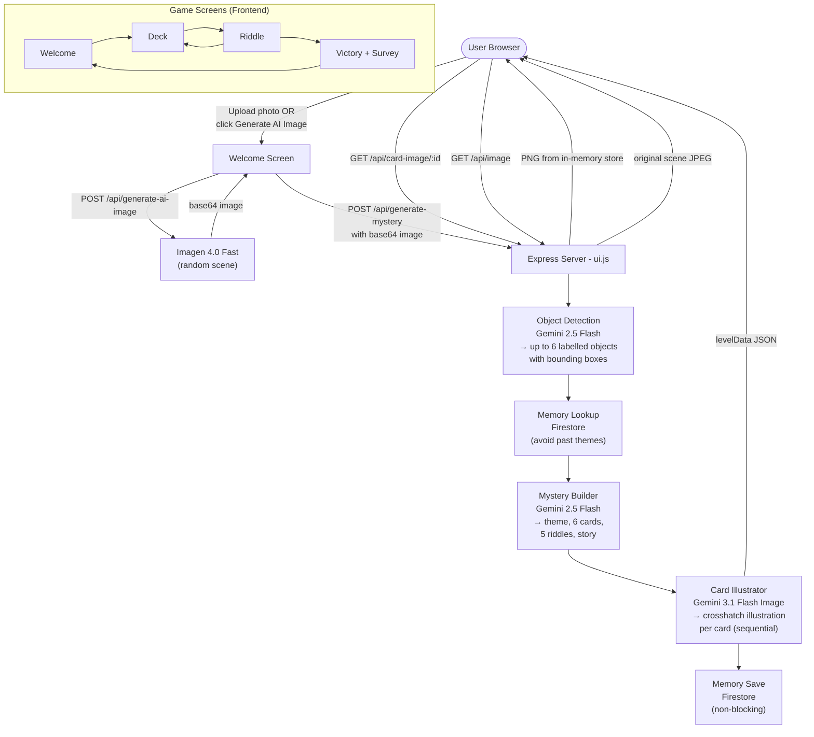

# GIST

An AI-powered card game. Upload any photo (or let AI generate one), and the game builds a unique set of illustrated riddle cards from whatever objects it finds in the image. Solve all the riddles to reveal the full story.

---

## How It Works

1. **Upload a photo** or click **Generate AI Image** to let the game create a random scene
2. The server detects up to 6 objects in the image and generates:
   - A themed card deck with crosshatch-style illustrated cards
   - 5 riddles (4 solo + 1 pair) tied to those objects
   - A narrative story woven from the riddle answers
3. Pick a card on the deck screen, solve its riddle by choosing the correct answer
4. Solve all riddles to unlock the full mystery story

---

## Features

- **AI image generation** — generates a random richly-detailed scene via Imagen 4
- **AI card illustrations** — each card gets a unique crosshatch pen illustration via Gemini 3.1 Flash Image
- **Object detection** — precise bounding boxes via Gemini 2.5 Flash
- **Riddle generation** — multiple-choice riddles with 4 answer options each
- **Story generation** — a narrative that uses every correct riddle answer as a plot point
- **Firestore memory** — avoids repeating themes/objects across sessions
- **Two-screen flow** — deck screen → riddle screen with back navigation
- **Progress tracking** — progress bar showing riddles solved

---

## Stack

| Layer | Technology |
|---|---|
| Server | Node.js + Express |
| AI (text/riddles) | Gemini 2.5 Flash (`@google/generative-ai`) |
| AI (card illustrations) | Gemini 3.1 Flash Image Preview (`@google/genai`) |
| AI (scene image) | Imagen 4.0 Fast (`@google/genai`) |
| Object detection | Gemini 2.5 Flash with JSON mode |
| Memory | Firebase Firestore |
| Frontend | Vanilla JS + CSS |

---

## Setup

### 1. Clone and install

```bash
git clone https://github.com/kjelenji/Gist.git
cd Gist
npm install
```

### 2. Add your API key

Create a `.env` file in the project root (or set the environment variable directly):

```
GEMINI_API_KEY=your_key_here
```

Get a key at [aistudio.google.com](https://aistudio.google.com).

### 3. (Optional) Firestore memory

To enable cross-session memory, add a Firebase service account file at `serviceAccount.json` in the project root. Without it, the game still works — it just won't avoid repeating past themes.

### 4. Run

```bash
npm start
```

Open [http://localhost:3000](http://localhost:3000).

---

## Project Structure

```
ui.js                        — Express server, all API endpoints, AI orchestration
public/
  index.html                 — Game HTML (welcome, deck, riddle, victory screens)
  script.js                  — Frontend game logic
  style.css                  — Styles
locate_objects_spatially.js  — Object detection with bounding boxes
generate_drawing.js          — Card illustration prompts
generate_story.js            — Story generation
memory.js                    — Firestore load/save
```

---

## System Architecture



### Request Flow Summary

| Step | Endpoint | Model | Purpose |
|---|---|---|---|
| 1 | `POST /api/generate-ai-image` | Imagen 4.0 Fast | (Optional) Generate a random scene |
| 2 | `POST /api/generate-mystery` | Gemini 2.5 Flash | Detect objects, build cards/riddles/story |
| 2a | — | Gemini 3.1 Flash Image | Generate crosshatch card illustrations |
| 3 | `GET /api/card-image/:id` | — | Serve cached card illustration |
| 4 | `GET /api/image` | — | Serve cached scene image for victory reveal |

---

## Deploying to Render

1. Push this repo to GitHub
2. Go to [render.com](https://render.com) → **New → Web Service**
3. Connect your GitHub repo (`kjelenji/Gist`)
4. Set the following:

| Setting | Value |
|---|---|
| **Environment** | `Node` |
| **Build Command** | `npm install` |
| **Start Command** | `npm start` |

5. Under **Environment Variables**, add:

| Key | Value |
|---|---|
| `GEMINI_API_KEY` | Your Gemini API key from [aistudio.google.com](https://aistudio.google.com) |

6. Click **Deploy** — Render will assign a public URL automatically

> Render's free tier spins down after inactivity. The first request after sleep takes ~30 seconds.

---
